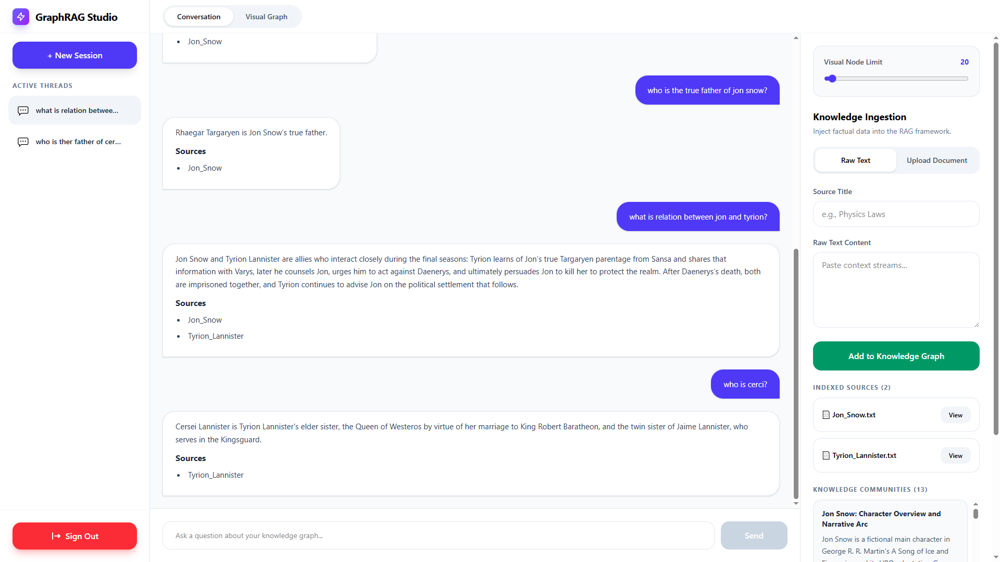
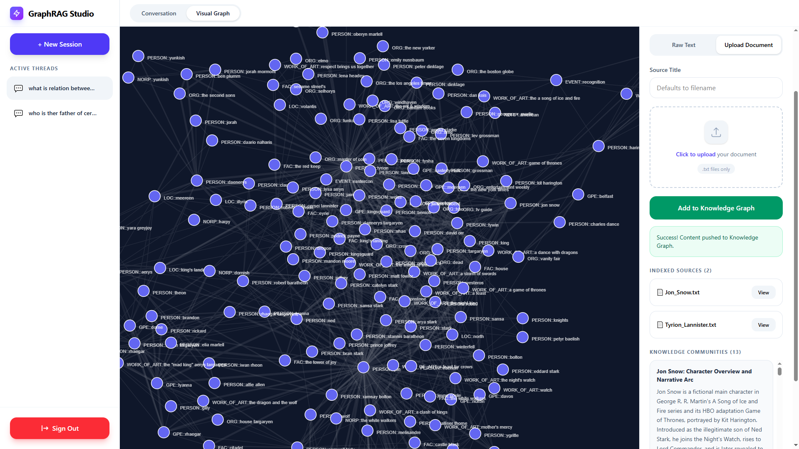

# 🧠 SciKG-GML

**SciKG-GML** is a full-stack, intelligent Knowledge Graph-enhanced Retrieval-Augmented Generation (RAG) application. Unlike traditional RAG systems that rely solely on flat vector similarity (which often loses global context and complex relationships), GraphRAG understands the *structure* of your data. It allows users to ingest text documents, automatically build a dynamic knowledge graph, detect thematic communities, and chat with the data using advanced hybrid retrieval and LLM-powered reasoning.



### 🔍 What is GraphRAG?
Traditional RAG splits documents into chunks and searches them based on keyword or vector similarity. This works for simple queries but fails at "global" questions (e.g., "What are the main themes of this document?") or complex, multi-hop reasoning. 

**GraphRAG** solves this by extracting entities (people, places, concepts) and their relationships to build a Knowledge Graph. It then groups related entities into "communities" and uses an LLM to generate high-level summaries for each group. This gives the AI both a **micro-level** view (specific facts) and a **macro-level** view (broad themes) of your data.

### ⚙️ How This Project Answers Questions
When you ask a question in SciKG-GML, the system doesn't just do a simple search. It executes a sophisticated, multi-step reasoning pipeline:

1. **Entity Extraction & Graph Expansion:** The system identifies key entities in your question. It then traverses the Knowledge Graph to find not just the exact matches, but also *neighboring entities* that are strongly related, ensuring no crucial context is missed.
2. **Hybrid Retrieval:** It performs a dual search:
   - **Local Search:** Combines dense vector embeddings (semantic meaning) with BM25 (exact keyword matching) to find the most relevant raw text chunks.
   - **Global Search:** Compares your question against the pre-computed LLM summaries of the graph's "communities" to identify the broad thematic areas relevant to your query.
3. **Reciprocal Rank Fusion (RRF) & Reranking:** The results from both local and global searches are merged, deduplicated, and passed through a Cross-Encoder Reranker. This critically evaluates and re-scores the chunks to ensure only the absolute highest-quality context is selected.
4. **LLM Synthesis:** Finally, the curated context (including relevant community summaries and specific text excerpts) is sent to the LLM with strict instructions to synthesize a concise, well-structured, and accurately cited answer based *only* on the provided knowledge.



## ✨ Features

### Backend (Django)
- **Advanced Ingestion Pipeline:** Parses, cleans, and chunks text intelligently with configurable window and overlap sizes.
- **Hybrid Retrieval:** Combines BM25 (sparse) and Vector Embeddings (dense) with Reciprocal Rank Fusion (RRF) and Cross-Encoder Reranking (`ms-marco-MiniLM-L-6-v2`) for maximum accuracy.
- **Knowledge Graph Construction:** Uses `spaCy` for Named Entity Recognition (NER) and `NetworkX` to build entity co-occurrence graphs.
- **Community Detection & Summarization:** Automatically clusters related entities using greedy modularity algorithms and generates high-level summaries per community using state-of-the-art LLMs.
- **High-Performance Worker Pool:** Configurable batching, retry limits, and concurrent workers for high-throughput node processing and embeddings generation.
- **Built-in Evaluation Suite:** Native support for evaluating dataset preparation, retrieval precision, and LLM generation performance.
- **Persistent State:** Caches graph states, communities, and embeddings for lightning-fast session restoration.

### Frontend (React)
- **Interactive Chat Interface:** Real-time messaging with full Markdown support. 
- **2D Graph Visualization:** Beautiful, interactive force-directed graph rendering using `react-force-graph-2d`.
- **Knowledge Panel:** View detected communities, their summaries, top entities, and indexed source files.
- **Responsive Design:** Fully responsive UI built with Tailwind CSS, optimized for both desktop and mobile.
- **Dynamic Tab Management:** Seamless switching between Chat, Visual Graph, and Knowledge ingestion.


## 🚀 Getting Started

### Prerequisites
- Python 3.10 or higher
- Node.js 18.x or higher
- Git

### 1. Download Project

```bash
# Clone the repository
git clone https://github.com/mohammad-majoony/graphrag-studio.git
cd graphrag-studio

```

### 2. Backend Setup

```bash
# Navigate to the backend directory
cd backend

# Create and activate a virtual environment
python -m venv venv

# On Windows (PowerShell):
.\venv\Scripts\Activate.ps1
# On Linux/macOS:
source venv/bin/activate  

# Install dependencies
pip install -r requirements.txt

# Download the spaCy English language model (Crucial Step)
python -m spacy download en_core_web_sm

# Create a `.env` file from `.env.example`
cp .env.example .env

# Run database migrations and start the server
python manage.py migrate
python manage.py runserver

```

### 3. Frontend Setup

```bash
# Open a new terminal and navigate to the frontend directory:
cd frontend

# Install dependencies:
npm install

# Create a `.env` file in the `frontend` directory
cp .env.example .env 

# Start the development server:
npm run dev

```

---

## ⚙️ Environment Variables

### Backend (`backend/.env`)

Below is the full environment configuration including RAG params, LLM endpoints, worker settings, and evaluation suite paths:

```env
# ============================================================
# RAG Pipeline Configuration
# ============================================================
RAG_CHUNK_SIZE=600
RAG_OVERLAP=80
RAG_TOP_K=20
RAG_TOP_N=5
RAG_TOP_SUMMARY=3

# ============================================================
# Batch & Token Limits
# ============================================================
EMBEDDING_BATCH_SIZE=500
CHAT_MAX_TOKENS=2048
SUMMARY_MAX_TOKENS=2048
CLEAN_NODE_MAX_TOKENS=2048
CHAT_HISTORY_LIMIT=10

# ============================================================
# Storage & Paths
# ============================================================
BASE_RAG_DIR=./user_rag_data

# ============================================================
# Security
# ============================================================
SECRET_KEY=your-custom-secret-key-here

# ============================================================
# LLM & Embedding Providers Configuration
# ============================================================
BASE_OPENAI_URL=https://integrate.api.nvidia.com/v1
API_KEY=your_api_key_here

# Models
LLM_MODEL=nvidia/nemotron-3-super-120b-a12b
EMBEDDING_MODEL=nvidia/nv-embed-v1
RERANKER_MODEL=cross-encoder/ms-marco-MiniLM-L-6-v2

# ============================================================
# Processing & Worker Settings
# ============================================================
WORKER_LIMIT=5
NODE_BATCH_SIZE=40
REQUEST_MAX_ATTEMPTS=5

# ============================================================
# Evaluation
# ============================================================
DATASET_FILES=novel19
SAMPLE=5

DATA_DIR=evaluation/dataset
WORK_SPACE=evaluation/workspace
RESULT_DIR=evaluation/results

```

### Frontend (`frontend/.env`)

```env
VITE_API_URL=http://localhost:8000/api

```

---

## 🧪 Running Evaluations

The backend includes a PowerShell runner script to execute dataset preparation, retrieval benchmarking, and response generation metrics sequentially.

Make sure you are in the `backend` directory before running:

```powershell
# Run the complete evaluation suite
.\evaluation\run_evaluation.ps1

```

---

## 📖 How to Use

1. **Create a Session:** Click "+ New Session" in the sidebar.
2. **Ingest Knowledge:** Go to the "Knowledge" tab. Paste raw text or upload a `.txt` file, then click "Add to Knowledge Graph".
3. **Wait for Processing:** The backend will chunk the text, extract entities via `spaCy`, build the graph, detect communities, and generate summaries using the LLM worker pool.
4. **Explore:**
* Switch to the **Visual Graph** tab to see the interactive node-link diagram. Adjust the "Visual Node Limit" slider to control complexity.
* View the **Knowledge Communities** panel on the right to read AI-generated summaries of different topics in your document.


5. **Chat:** Return to the **Conversation** tab and ask questions. The system will use hybrid retrieval and graph neighborhood expansion to provide highly accurate, cited answers.

---

## 📂 Project Structure

```bash
graphrag-studio/
├── backend/
│   ├── grag/                 # Django core app settings
│   ├── core/                 # GraphRAG logic (indexing, pipeline, vector store)
│   ├── evaluation/           # Evaluation tools, datasets, and PowerShell scripts
│   ├── authentication/       # User authentication & token management
│   ├── manage.py             # Django management script
│   └── requirements.txt      # Python dependencies
├── frontend/
│   ├── public/               # Static assets
│   ├── src/
│   │   ├── components/       # Reusable UI components (Auth, Graph, Chat)
│   │   ├── App.jsx           # Main App routing
│   │   └── main.jsx          # React entry point
│   ├── package.json          # Node dependencies
│   └── vite.config.js        # Vite configuration
└── README.md                 # Project documentation

```

## 📄 License

This project is open-source and licensed under the [MIT License](https://www.google.com/search?q=LICENSE).
